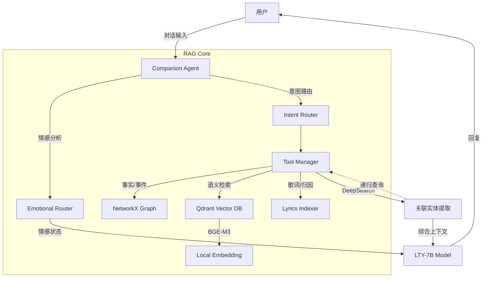

# 洛天依 LTY-Omni-Agent

> "无论世界怎么变化，都会有人一直为你唱下去...直到荒芜。"

## 项目简介

**LTY-Omni-Agent** 是一个专为"洛天依"IP打造的垂直领域 Agentic RAG 系统。

深度整合 **知识图谱 (Knowledge Graph)**、**向量数据库 (Qdrant)** 和 **多跳推理 (DeepSearch)** 技术，提供高精度、强共情且符合官方设定的沉浸式对话体验。支持**情感陪伴模式**和**知识检索模式**双模切换，以及**完全本地化运行**。

---

## 核心特性

### 情感陪伴模式（默认）
- **智能情感识别** — 识别开心、难过、焦虑、孤独、愤怒、疲惫、困惑等情感状态
- **长期情感记忆** — 建立用户情感档案，关系随互动加深
- **自然共情回应** — 像朋友一样交流，拒绝模板化套话

### 知识检索模式
- **DeepSearch 多跳推理** — 自动递归检索关联实体，拒绝"只知其名不知其详"
- **三路混合检索** — 知识图谱（精确事实）+ 向量数据库（长文本语义）+ 歌词元数据（归因查询）
- **事实核查与归因** — 严禁编造，所有回答基于检索数据

### 回复风格
- `casual`（口语化）— 日常交流，柔和自然
- `professional`（专业）— 知识查询，准确清晰
- `concise`（简短）— 高效交流，简洁明了

### 本地化与隐私
- **Embedding**: 集成 BGE-M3 模型（支持 GPU 加速），本地生成语义向量
- **Vector DB**: Qdrant Local Mode，轻量高效
- **数据存储**: 所有数据（含情感记忆）存储在本地

---

## 技术架构



---

## 快速开始

### 1. 环境准备

Python 3.10+，推荐 Conda 环境。

```bash
pip install -r requirements.txt
```

### 2. 配置

复制 `.env.example` 为 `.env` 并修改：

```ini
# 聊天模型（Ollama 本地模型）
CHAT_API_BASE=http://localhost:11434/v1
CHAT_MODEL_NAME=lty_v6:7b
CHAT_API_KEY=ollama

# Embedding / 检索模型（可选 DashScope 云端，本地有 BGE-M3 时自动优先使用本地）
GEN_API_BASE=https://dashscope.aliyuncs.com/compatible-mode/v1
GEN_API_KEY=sk-xxxxxxxx
GEN_MODEL_NAME=qwen-plus
```

### 3. 启动

```bash
# 情感陪伴模式（默认）
python main.py

# 知识检索模式
python main.py --regular

# 指定回复风格
python main.py --style casual

# 查看帮助
python main.py --help-ui
```

Windows 用户也可双击 `start.bat` 启动。

---

## 交互命令

| 命令 | 功能 |
|------|------|
| `help` | 显示帮助信息 |
| `switch mode` | 切换情感陪伴 / 知识检索模式 |
| `set style [casual\|professional\|concise]` | 设置回复风格 |
| `status` | 查看当前状态与情感记忆 |
| `memory` | 查看情感记忆详情 |
| `exit` / `quit` | 退出 |

---

## 对话示例

**多跳推理**
```
普通 You: 你去年开了什么演唱会？
天依: （系统自动查到"无限共鸣" → 追查详情 → 回答包含时间地点和曲目）
```

**歌词归因**
```
普通 You: 勾指起誓是谁写的？
天依: 这首歌是 ilem 创作的...
```

**情感陪伴**
```
情感 You: 今天好累啊
天依: 嗯，辛苦了。要不要聊点别的放松一下？
```

---

## 项目结构

```
rag_lty/
├── main.py                # 启动入口
├── config.py              # 全局配置
├── requirements.txt       # 依赖
├── rag_core/              # 核心逻辑
│   ├── companion_agent.py # Agent 主控（含 DeepSearch）
│   ├── router.py          # 意图路由
│   ├── emotional_router.py# 情感分析路由
│   ├── emotional_memory.py# 情感记忆系统
│   ├── response_style.py  # 回复风格管理
│   ├── llm_client.py      # LLM 客户端
│   ├── embeddings.py      # 向量化（BGE-M3 / DashScope）
│   ├── rag_tools.py       # 工具接口
│   └── indexing/           # 索引模块
│       ├── fact_indexer.py # Qdrant 向量索引
│       ├── graph_indexer.py# NetworkX 知识图谱
│       └── lyrics_indexer.py# 歌词元数据索引
├── dataset/
│   ├── knowledge_base/    # Markdown 百科文档
│   ├── song/              # 歌词数据
│   └── data_gen/          # 数据生成脚本
├── models/                # 本地模型（BGE-M3）
├── prompt/                # System Prompt 模板
└── utils/                 # 工具函数
```

---

## 维护

- **新增知识**: 将 `.md` 文件放入 `dataset/knowledge_base/` 对应子目录，重启自动增量索引
- **全量重建**: 删除 `dataset/vector_store/qdrant_lty/` 目录后重启即可触发重建

---

*Created by YiGuMoYan.*
