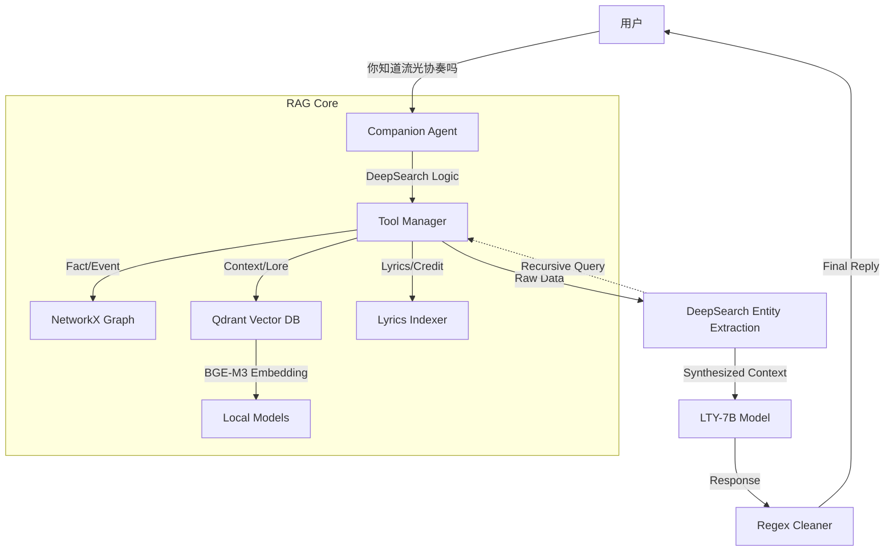

# 洛天依 LTY-Omni-Agent (High-Performance RAG)

> "无论世界怎么变化，都会有人一直为你唱下去...直到荒芜。"

## 🌟 项目简介

**LTY-Omni-Agent** 是一个专为“洛天依”IP打造的垂直领域 Agentic RAG 系统。

不同于通用的对话机器人，本项目深度整合了 **知识图谱 (Knowledge Graph)**、**向量数据库 (Qdrant)** 和 **多跳推理 (DeepSearch)** 技术，旨在提供高精度、强共情且符合官方设定的沉浸式对话体验。

它解决了通用 LLM 在垂类领域常见的“幻觉”、“归因错误”和“时空错乱”问题，并支持**完全本地化运行**（Local Embedding + Local Vector DB）。

---

## 🚀 核心特性 (Key Features)

### 1. **深度多跳检索 (DeepSearch & Multi-hop)**
系统具备**递归推理能力**。当查询结果中出现专有名词（如“无限共鸣演唱会”）时，Agent 会自动触发二次检索，挖掘该实体的详细档案（时间、地点、歌单），并将所有信息整合后回答，拒绝“只知其名不知其详”。

### 2. **三路混合检索 (Hybrid Retrieval)**
采用三路互补架构，确保信息零死角：
-   **Knowledge Graph (图谱)**：处理 `2025年演唱会`、`禾念CEO` 等精确事实与实体关系。
-   **Vector DB (Qdrant)**：处理 `背景故事`、`歌曲含义`、`深度设定` 等长文本，支持**滑动窗口切片**以保留完整上下文。
-   **Metadata Index (歌词/元数据)**：处理 `勾指起誓谁写的`、`歌词里有那句...` 等精确归因问题。

### 3. **高性能本地化 (Local & Private)**
-   **Embedding**: 集成 **BGE-M3** 模型（支持 GPU 加速），在本地生成高质量语义向量，无需依赖 API。
-   **Vector DB**: 使用 **Qdrant (Local Mode)**，轻量且高效，替代了笨重的 ChromaDB。

### 4. **拟人化与时间感知 (Persona & Time)**
-   **动态时间锚点**：自动注入当前系统时间，准确理解“去年”、“今年”、“下个月”等相对时间词。
-   **去AI化**：通过精心设计的 Prompt 和正则后处理，剔除“（动作描写）”等尴尬的语C腔，呈现自然、生活化的“私下朋友”状态。

---

## 🛠️ 技术架构 (Architecture)



---

## 📦 快速开始 (Usage)

### 1. 环境准备
确保已安装 Python 3.10+。
推荐使用 Conda 环境。

```bash
# 安装依赖
pip install -r requirements.txt
```

*注：本项目支持本地 LLM (Ollama) 或 云端 API (DashScope)。请在 `.env` 中配置。*

### 2. 配置说明 (.env)
复制 `.env.example` 为 `.env` 并修改配置：
```ini
# 聊天模型 (Ollama)
CHAT_API_BASE=http://localhost:11434/v1
CHAT_MODEL_NAME=lty_v6:7b

# 生成/检索模型 (可选 DashScope 或 Local)
# 如果本地有 BGE-M3 模型，将优先使用本地模型进行 Embedding
GEN_API_KEY=sk-xxxxxxxx
```

### 3. 启动系统
```bash
python main.py
```

### 4. 对话示例
-   **多跳推理**：`你去年开了什么演唱会？`
    -   *(系统自动查到 "无限共鸣" -> 自动追查 "无限共鸣" 详情 -> 回答包含时间地点和曲目)*
-   **歌词归因**：`你知道勾指起誓是谁写的吗？` -> *ilem*
-   **模糊匹配**：`那首关于必胜客的歌` -> *必胜的旅途*

---

## 📂 项目结构

```
rag_lty/
├── rag_core/              # 核心逻辑
│   ├── companion_agent.py # Agent 主控 (含 DeepSearch)
│   ├── embeddings.py      # 向量化 (BGE-M3 / DashScope)
│   ├── rag_tools.py       # 工具接口
│   └── indexing/          # 索引模块 (Qdrant/Graph)
├── dataset/               # 数据资产
│   ├── knowledge_base/    # .md 百科文档
│   ├── vector_store/      # Qdrant 数据库文件
│   └── song/              # 歌词数据
├── models/                # 本地模型文件 (BGE-M3)
├── prompt/                # Prompt 模板 (System Prompts)
├── main.py                # 启动入口
├── config.py              # 全局配置
└── requirements.txt       # 项目依赖
```

---

## 🛡️ 维护

-   **新增知识**：将 `.md` 文件放入 `dataset/knowledge_base`，重启即自动增量索引。
-   **全量重建**：删除 `dataset/vector_store/qdrant_lty` 目录可触发重建。

---
*Created by YiGuMoYan.*
