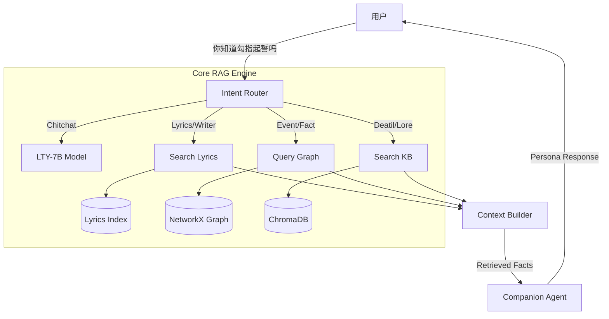

# 洛天依 LTY-Omni-Agent (Commercial Ver.)

> "无论世界怎么变化，都会有人一直为你唱下去...直到荒芜。"

## 🌟 项目简介

**LTY-Omni-Agent** 是一个专为“洛天依”IP打造的商业级垂直领域 Agentic RAG 系统。不同于通用的对话机器人，它旨在通过深度整合 **知识图谱 (Graph)**、**向量数据库 (Vector DB)** 和 **结构化元数据 (Lyrics/Metrics)**，提供高精度、强共情及符合官方设定的角色扮演体验。

本项目解决了通用 LLM 在垂类领域常见的“幻觉”、“归因错误”和“时空错乱”问题，实现了从“简单问答”到“智能助理”的跨越。

---

## 🚀 核心特性 (Key Features)

### 1. **全维度精准检索 (Tri-Source Retrieval)**
系统摒弃了单一的向量检索，采用 **三路混合检索架构**，确保信息零死角：
-   **Knowledge Graph (图谱)**：处理 `2025年演唱会`、`禾念CEO` 等精确事实与实体关系。
-   **Vector DB (知识库)**：处理 `背景故事`、`歌曲含义`、`深度设定` 等非结构化文本。
-   **Metadata Index (歌词/元数据)**：处理 `勾指起誓谁写的`、`歌词里有那句...` 等精确归因问题。

### 2. **商业级意图路由 (Commercial Intent Router)**
重构了 `IntentRouter`，具备极强的鲁棒性：
-   **拒识与闲聊**：精准区分“你好”与“查询”，避免无效消耗。
-   **多轮上下文**：支持 `讲讲`、`细说` 等追问，自动回溯上文实体。
-   **时间感知**：自动解析 `去年`、`明年` 等相对时间，结合当前系统时间进行推演。
-   **防幻觉机制**：严禁翻译实体名（如不将“勾指起誓”翻译为英文），强制使用原名检索。

### 3. **模糊搜索与纠错 (Fuzzy Matching)**
-   集成 `difflib` 模糊匹配算法，支持 `流光协奏`、`66ccff` 等关键词的容错查询。
-   自动过滤 `the`, `meaning` 等无意义停用词，提升检索纯度。

### 4. **秒级启动 (Instant Startup)**
-   引入**增量索引机制**，智能检测文件变动。
-   冷启动时间从 **60秒+** 优化至 **<1秒**。

---

## 🛠️ 技术架构 (Architecture)



---

## 📦 快速开始 (Usage)

### 1. 环境准备
确保已安装 Python 3.10+ 及依赖：
```bash
pip install -r requirements.txt
```
*注：需确保本地运行 Ollama 服务及 `lty_v6:7b` 模型。*

### 2. 启动系统
```bash
python main.py
```

### 3. 对话示例
-   **查归属**：`你知道勾指起誓是谁写的吗？` (精准回答: ilem)
-   **查时间**：`去年开了什么演唱会？` (自动推算: 2025年无限共鸣)
-   **查背景**：`讲讲这首歌的意义` (深度检索: COP的创作视角)
-   **模糊搜**：`机械的心率` (自动匹配歌词)

---

## 📂 项目结构

```
rag_lty/
├── rag_core/
│   ├── router.py          # 意图路由核心 (Prompt Engineering)
│   ├── companion_agent.py # Agent 主循环与回复生成
│   ├── rag_tools.py       # 工具集 (Tools Interface)
│   └── indexing/          # 索引模块
│       ├── fact_indexer.py   # 向量库索引 (ChromaDB)
│       ├── graph_indexer.py  # 图谱索引 (NetworkX)
│       └── lyrics_indexer.py # 歌词索引 (In-Memory)
├── dataset/
│   ├── knowledge_base/    # .md 格式知识库文件
│   └── data_gen/          # 数据生成与处理脚本
├── scripts/               # 自动化测试脚本
│   ├── regression_test.py # 回归测试
│   └── verify_agent.py    # Agent 验证
└── main.py                # 启动入口
```

---

## 🛡️ 维护与更新
-   **更新知识库**：只需将新的 `.md` 文件放入 `dataset/knowledge_base`，重启系统自动增量更新。
-   **强制重构索引**：删除 `dataset/vector_store` 目录即可触发全量重建。

---
*Created by YiGuMoYan.*
