# 洛天依 LTY-Omni-Agent

> "无论世界怎么变化，都会有人一直为你唱下去...直到荒芜。"

## 项目简介

**LTY-Omni-Agent** 是一个专为"洛天依"IP打造的垂直领域 Agentic RAG 系统。

深度整合 **知识图谱 (Knowledge Graph)**、**向量数据库 (Qdrant)** 和 **多跳推理 (DeepSearch)** 技术，提供高精度、强共情且符合官方设定的沉浸式对话体验。支持**情感陪伴模式**和**知识检索模式**双模切换，以及**完全本地化运行**。

系统现已全面支持**全异步架构 (Async)**、**流式语音合成 (TTS)** 和 **Live2D 动作驱动**。

---

## 核心特性

### 🎭 情感陪伴模式（默认）
- **智能情感识别** — 识别开心、难过、焦虑、孤独、愤怒、疲惫、困惑等情感状态
- **长期情感记忆** — 建立用户情感档案，关系随互动加深 (Rolling Summary)
- **自然共情回应** — 像朋友一样交流，拒绝模板化套话
- **Live2D 驱动** — 语音、表情、动作三位一体，随情感动态变化

### 🧠 知识检索模式
- **DeepSearch 多跳推理** — 自动递归检索关联实体，拒绝"只知其名不知其详"
- **三路混合检索** — 知识图谱（精确事实）+ 向量数据库（长文本语义）+ 歌词元数据（归因查询）
- **事实核查与归因** — 严禁编造，所有回答基于检索数据

### ⚡ 架构优化
- **全异步设计** — 核心 RAG 管道与 LLM 调用全面异步化，高并发下响应更灵敏
- **并行 DeepSearch** — 多实体关联查询自动并行执行，大幅缩短检索耗时
- **统一生成架构** — 一次 LLM 调用同时生成回复文本与 Live2D 参数，降低延迟

---

## 技术架构

```mermaid
graph TD
    User[用户] --> |WebSocket| Server[Async WS Server]
    Server --> Agent[Companion Agent]

    subgraph "RAG Core (Async)"
        Agent --> |情感分析| Emotion[Emotional Router]
        Agent --> |意图路由| Router[Intent Router]
        Router --> Tools[Tool Manager]
        Tools --> |事实/事件| Graph[NetworkX Graph]
        Tools --> |语义检索| Vector[Qdrant Vector DB]
        Tools --> |歌词/归因| Lyrics[Lyrics Indexer]
        Vector --> |BGE-M3| Models[Local Embedding]
    end

    subgraph "Generation"
        Entity[DeepSearch] -.-> |递归并行查询| Tools
        Entity --> |综合上下文| LLM[LTY-7B Model]
        Emotion --> |情感状态| LLM
        LLM --> |Unified Generation| Gen[Response + Live2D]
        Gen --> |Stream| TTS[CosyVoice TTS]
    end

    Gen --> |Text + Motion| User
    TTS --> |Audio Stream| User
```



---

## 快速开始

### 1. 环境准备

Python 3.10+，推荐 Conda 环境。

```bash
pip install -r requirements.txt
```

### 2. 配置

复制 `.env.example` 为 `.env` 并修改：

```ini
# 聊天模型（Ollama 本地模型）
CHAT_API_BASE=http://localhost:11434/v1
CHAT_MODEL_NAME=lty_v6:7b
CHAT_API_KEY=ollama

# Embedding / 检索模型（可选 DashScope 云端，本地有 BGE-M3 时自动优先使用本地）
GEN_API_BASE=https://dashscope.aliyuncs.com/compatible-mode/v1
GEN_API_KEY=sk-xxxxxxxx
GEN_MODEL_NAME=qwen-plus

# 语音合成服务
TTS_ENABLED=True
TTS_SERVER=http://your-cosyvoice-api
```

### 3. 启动

#### 启动 WebSocket 服务 (推荐)
支持前端 Live2D 交互。

```bash
python ws_server.py
```

#### 启动 CLI 交互模式
纯文本调试模式。

```bash
python main.py
```

---

## 项目结构

```text
rag_lty/
├── main.py                 # CLI 启动入口
├── ws_server.py            # WebSocket 服务入口
├── config.py               # 全局配置
├── rag_core/               # 核心逻辑模块
│   ├── agent/              # Agent 主控逻辑
│   ├── emotions/           # 情感记忆系统
│   ├── knowledge/          # 知识库与检索工具 (Graph, Vector, Lyrics)
│   ├── llm/                # LLM 与 Embedding 客户端
│   ├── routers/            # 意图与情感路由
│   └── generation/         # 生成模块 (Live2D, TTS, Style)
├── dataset/                # 数据集
│   ├── knowledge_base/     # Markdown 百科文档
│   └── song/               # 歌词数据
└── models/                 # 本地模型文件
```

---

## 维护

- **新增知识**: 将 `.md` 文件放入 `dataset/knowledge_base/` 对应子目录，重启自动增量索引
- **全量重建**: 删除 `dataset/vector_store/qdrant_lty/` 目录后重启即可触发重建

---

*Created by YiGuMoYan.*
